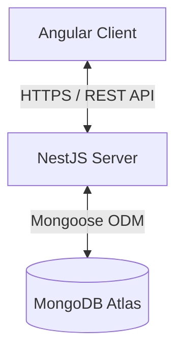

# System Architecture - FlowCRM 🏛

This document details the system design, components, security models, data flows, and code patterns governing **FlowCRM**.

---

## 1. System Overview
FlowCRM uses a decoupled client-server architecture:
1. **Frontend (Angular)**: Single Page Application (SPA) utilizing Angular Material for visual presentation, Angular Signals for reactive state management, and Chart.js for data visualization.
2. **Backend (NestJS)**: A RESTful API built on the NestJS modular framework, handling authentication, business logic, validation, and data persistence.
3. **Database (MongoDB Atlas)**: Document-oriented database using Mongoose ODM to enforce schema-level structures.



---

## 2. Backend Layer Architecture
NestJS code follows the Layered Architecture pattern (separation of concerns):

```
Incoming Request
      │
      ▼
  Controller (DTO validation via class-validator)
      │
      ▼
   Service   (Business logic, transactional checks)
      │
      ▼
  Repository (Mongoose Model mapping and queries)
      │
      ▼
  Database   (MongoDB collection update/read)
```

- **Controllers**: Define route paths, bind middleware/guards, parse parameters, and return HTTP responses.
- **Services**: Contain business operations, access data from models, and handle logic operations.
- **Models/Schemas**: Enforce validation, field structures, indices, and mongoose helper methods.

---

## 3. Frontend Architecture
The Angular application uses a modular, feature-based directory structure:

- **Core**: Services and classes initialized once (Singleton instances, HTTP interceptors, Global configs, Authentication store).
- **Shared**: Reusable UI elements, pipes, directives, schemas, UI utility configurations, and shared material modules.
- **Layouts**: Template containers organizing UI segments like the Sidebar, Navbar, and Dashboard layouts.
- **Features**: Functional workspaces containing components, routes, and views for specific business domains (e.g. `leads`, `deals`, `contacts`).

```
src/
├── core/
│   ├── auth/
│   ├── interceptors/
│   └── services/
├── shared/
│   ├── components/
│   └── models/
├── layouts/
│   ├── sidebar/
│   └── dashboard-layout/
└── features/
    ├── dashboard/
    ├── leads/
    └── deals/
```

---

## 4. Multi-Tenant Architecture
FlowCRM enforces data isolation at the schema level.
- Every business account registers a unique `Organization`.
- Almost every entity (User, Lead, Customer, Deal, Activity, Task) has an `organizationId` field referencing the Organization.
- **Security Check**: Queries are always scoped to the user's logged-in `organizationId` decoded from the JWT token.
- This setup ensures different tenant organizations cannot view or manipulate each other's data.

---

## 5. Security & Authorization (RBAC)

### 5.1 Authentication (JWT)
1. User requests login, backend validates password hash (`bcrypt`).
2. Backend responds with a signed JWT containing payload: `{ userId, organizationId, role }`.
3. Frontend stores JWT and attaches it to request headers via an `AuthInterceptor`.

### 5.2 Role-Based Access Control Flow
We implement authorization at two points:
- **Backend (NestJS Guards)**: Annotate controllers or endpoints with custom decorators (e.g. `@Roles(Role.SALES_MANAGER)`). The guard verifies the role claims in the incoming JWT payload against allowed roles.
- **Frontend (Angular Route Guards)**: Verify user session validity and route authorization properties before rendering a feature page.

```
Request ──► JWT Guard (Verify JWT integrity) ──► Roles Guard (Verify Role permissions) ──► Exec Controller
```
